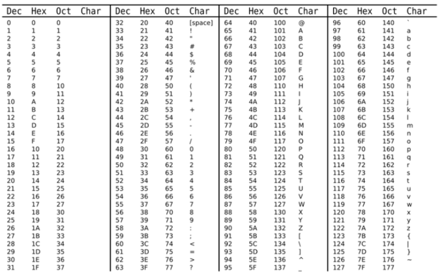
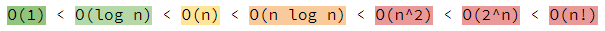
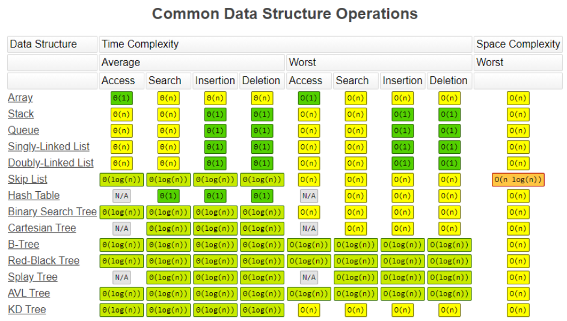
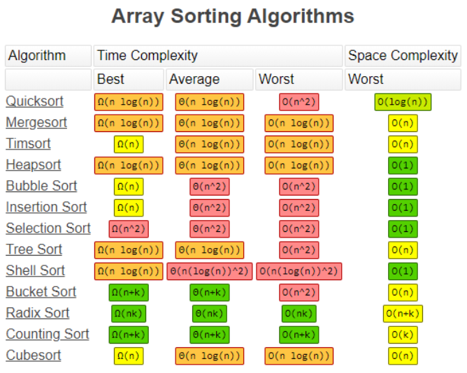

# General Utils

## Problem-solving process

* **Frequently criticize your understanding of the question**, always ask questions, and communicate with the interviewer to** confirm you have sufficient, accurate info** to solve the problem.  
* **Expand the problem and reveal the hidden messages**, like value boundaries, limitations, and many other edge cases you can think of.
* **Start with a simple, boring, or not much efficient solution** (but it sure does the job, covering everything you need),
  *  You can either **start coding it** if you are not confident about thinking of a better solution, 
    * discuss what to **improve your code **and how would it be better with the interviewer, of course, the main idea is about runtime and space, talk about how you improved your big O.
  * Or you can talk about this simple solution briefly if you already have a clear and better solution in your head, start implementing it. Then get straight to the structure of your better solution. 
* Always explain what are you doing when coding, too much silence is not very good. Explain why if necessary.
* Don't scare yourself if you make mistakes, admit it and analyze why it was wrong, talk about how can you improve it! This is always a good quality they would be looking for in an employer: calm, confident, honest, and logical.
* Try to keep your movement clean, trust me, people like that. Also, smile and be friendly.

## Common Mistakes (Duh)

* Last accumulated data:
  * Remember there can be a last accumulated data after the iteration, don't ignore it, it might be useful :(

## Ivy's messed up syntaxes

* ** Max/Min value for Integer: `Integer.MAX_VALUE` / `Integer.MIN_VALUE`**
* **Priority Queue**:  [https://docs.oracle.com/javase/7/docs/api/java/util/PriorityQueue.html](https://docs.oracle.com/javase/7/docs/api/java/util/PriorityQueue.html)

.png>)

.png>)

## ASCII Table




## Useful code snippet:

Integer.MIN_VALUE:-2147483648

Integer.MAX_VALUE:+2147483647

O(nlogk) < O(nlogn), k is constant , and n is infinity case.

How to traverse 4 direction in array of array

```
        int[][] directions = {{0, 1}, {1, 0}, {0, -1}, {-1, 0}};
        
        for(int[] d : directions){
            int neighborRow = row + d[0];
            int neighborCol = col + d[1];
        if (neighborRow >= 0 && neighborRow < rows && 
             neighborCol >= 0 && neighborCol < cols) {
                //do work
                dfs(grid,neighborRow,neighborCol);

        }       
        }
```

**In place**: It is an algorithm which transforms input using no auxiliary data structures.

```
throw new IllegalArgumentException("No such element");
```

### Get all the digits:

```
int number; // = some int

while (number > 0) {
    print( number % 10);
    number = number / 10;
}
```

### Write own comparator:

```
class ElementComparator implements Comparator<Element> {
  public int compare(Element e1, Element e2) {
    if (e1.frequency != e2.frequency)
       return e2.frequency - e1.frequency;
    return e2.sequenceNumber - e1.sequenceNumber;
  }
}


// Another comparator:
        Comparator<String> myComp = new Comparator<String>() {
            @Override
            public int compare(String log1, String log2) {
                // split each log into two parts: <identifier, content>
                String[] split1 = log1.split(" ", 2);
                String[] split2 = log2.split(" ", 2);

                boolean isDigit1 = Character.isDigit(split1[1].charAt(0));
                boolean isDigit2 = Character.isDigit(split2[1].charAt(0));

                // case 1). both logs are letter-logs
                if (!isDigit1 && !isDigit2) {
                    // first compare the content
                    int cmp = split1[1].compareTo(split2[1]);
                    if (cmp != 0)
                        return cmp;
                    // logs of same content, compare the identifiers
                    return split1[0].compareTo(split2[0]);
                }

                // case 2). one of logs is digit-log
                if (!isDigit1 && isDigit2)
                    // the letter-log comes before digit-logs
                    return -1;
                else if (isDigit1 && !isDigit2)
                    return 1;
                else
                    // case 3). both logs are digit-log
                    return 0;
            }
        };
```

### Character related stuffs:

```
65-90 A-Z  97-122 a-z
Chr - ‘A’ → 给出离A的距离， 如果 Chr is C 那就会返还2
Character.isDigit()
Character.isLowerCase()
Character.toUpperCase()
```

### Array & ArrayList

```
//1. Change arraylist to array
Integer[] arr = new Integer[al.size()]
arr =  al.toArray(arr);

// Change array to arraylist
List<String> list = Array.asList(ary);

// Array Initialization: 
int intArray[]; // declaring array
intArray  = new int[20]; // allocating memory

//When array size is already known:
int [] ary = new int[]{1,2,3,4,5};

// array clone
int intArray[][] =  {{1,2,3}.{4,5}}
int cloneArray [][] = intArray.clone();


// copy part of array

Arrays.copyOfRange(ary,0,k);


// Represent row and col together in one numeber
int index = row*n+col;  // of n columns
int row = index/n;
int col = index%n;

// put character frequency
int freq [] = new int[256];
for(int i = 0; i < s.length(); i ++)
    freq [s.charAt(i) - 'a'] ++;
    
    
// convert from arraylist to array
result.toArray(new int[result.size()][]);
```

### Linkedlist:

.png>)

### Set:

```
Set<Obj> set = new HashSet<Obj> (); 
set.add();
set.addAll(Collections);//collections , list
set.clear()
set.contains();
set.size();
set.toArray()


// Iterating through the Set
    // via for-each loop
    for (String value : hs)
        // Printing all the values inside the object
        System.out.print(value + ", ");
```

### Stack:

FILO

```
Stack<String> stackName = new Stack<>();
Stack.push()
stack.pop()
stack.peek() ---> return the element on the top of the stack, if it is null throw exception
stack.empty() ---> it returns true if it is empty

//变成Arraylist： list = new ArrayList<stack>
```

### Queue:

FIFO

```
 Queue<Integer> q = new LinkedList<>();
 
 queue.add()
 queue.peek();
 queue.poll()// remove and returns head
 queue.size()
```

### Map:

 _TreeMap_ are **sorted according to their natural order**.

```
Map<String,Integer> map = new HashMap<String,Integer>();

        // Traversing through the map
        for (Map.Entry<String, Integer> me : hm.entrySet()) {
            System.out.print(me.getKey() + ":");
            System.out.println(me.getValue());
        }
        
        // Insert element:
        hm1.put(1, "Geeks");
        
        // Remove element
        hm1.remove(new Integer(4));
        
        // return map size
        map.size()
        
        // contains key?
        map.containsKey()
```

### PriorityQueue or Heap:

we built heap by priorityQueue

```
public int findKthLargest(int[] nums, int k) {
        PriorityQueue<Integer> minHeap = new PriorityQueue<Integer>((n1, n2) -> n1 - n2);
        
        for(Integer cur : nums){
            minHeap.add(cur);
            if(minHeap.size() > k)
                minHeap.poll();
        }
        return minHeap.peek(); 
}


// Create a map entry priority queue
PriorityQueue<Map.Entry<String, Integer>> pq = new PriorityQueue<>(
         (a,b) -> a.getValue()==b.getValue() ? b.getKey().compareTo(a.getKey()) : a.getValue()-b.getValue()
);

// add map into the max heap
pq.addAll(characterFrequencyMap.entrySet());

Map.Entry<Character, Integer> entry = pq.poll();
```


### Trees:

* In-order, give us ascending order

.png>)

* Post order: left right root.
* Pre-order:root left right

.png>)


### String:

String concatenation takes O(N^2):

It first create an entirely new string, allocate enough memory for everything, copying all the data from the existing value of x and the copy the data from the string be append.

```
str.charAt(int index);
str.compareTo(strB); //Compares two strings lexicographically.
str.compareToIgnoreCase(String strB)
str.equals(strB);
str.indexOf(int ch); // return  -1 if not found
str.length();
str.subString(int beginIndex, int endIndex);Returns a new string that is a substring of this string.
str.toCharArray();// convert to char array
str.toUpperCase()
str.toLowerCase()
// Generate string format
String.format("%d->%d", n1, n2);


// Convert number into string
String.valueOf(n1)


```

### StringBuilder:

```
str.append() 添加
str.toString()  ---> return a string representing the data
str.reverse() ---> reverse string
str.replace(start,end, string)----> replace this substring
str.length()---> return length
str.deleteCharAt(index); 
```

## Big O Cheat Sheet






